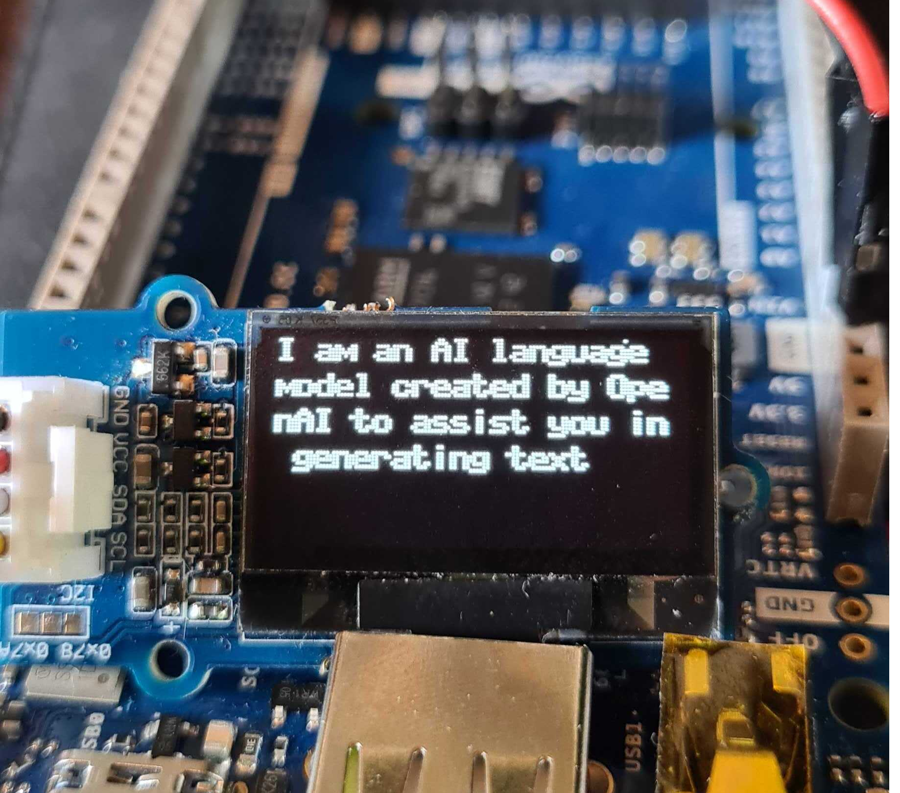

# upython-chat-gpt

ChatGPT for MicroPython.

## Overview

This repository contains an example that allows you to connect to ChatGPT using MicroPython. It makes a POST request to the OpenAI API with a question and receives a response that is then printed on an OLED display. 

This example has been tested to work with the [Giga R1 WiFi](https://store.arduino.cc/products/giga-r1-wifi) board and a generic ESP32 board and should be compatible with other boards supporting MicroPython.

To connect to OpenAI, you will need an account with a payment plan as this is not a free service. However, you can play around with this for days without spending more than a dollar.

## Hardware Requirements
- [GIGA R1 WiFi](https://store.arduino.cc/products/giga-r1-wifi)
- [OLED SSD1315 (I2C)](https://wiki.seeedstudio.com/Grove-OLED-Display-0.96-SSD1315/) display.*

\*Other similar OLED displays may work but have not yet been tested with this setup.

## Hardware Setup

Wire the display to the GIGA R1 WiFi using the following chart:

| GIGA R1 WiFi | OLED SSD1315 |
| ------------ | ------------ |
| SDA          | SDA          |
| SCL          | SCL          |
| GND          | GND          |
| 5V           | VCC          |

## Software Setup

1. Install MicroPython on your board. To install on the GIGA R1 WiFi, follow [this guide]().
2. Install a MicroPython-compatible editor (like [Thonny](https://thonny.org/) or [Arduino Lab for MP](https://labs.arduino.cc/en/labs/micropython))
3. Install the SSD1306 OLED driver on your board, either by installing directly via Thonny's built-in package manager or by copying over the `ssd1306.py` file in this repository to the `lib` folder of your board.
4. Create an account with [OpenAI](https://openai.com/). Once created, you will need to register a credit card or another payment method. You should then be able to create an API key.
5. In the example script, add your API key in the `api_key` field.
6. In the example script, you will also need to add your WiFi network SSID + PASS.

You should now have met all the requirements to use the example script provided in this repository.

## Usage

When you have set it up properly, anytime you launch the script, the following will happen:
- The content of `open_ai_question` is sent in a POST request to the OpenAI API, which will return a response. This uses the `urequests` & `ujson` modules. 
- The response is printed on the OLED display, letter by letter for extra dramatic effect.\*

\*I couldn't find a text wrap function in the `ssd1306.py` module so I made a quick and dirty improvisation (the `print_oled()` function). 

That's it! The request was built using [Postman](https://www.postman.com/) and can be tuned to whatever you like.

